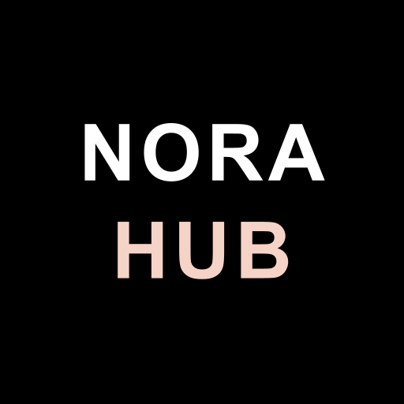

<div align="center">
  

  # Nora Hub

  Portal privado y cuaderno personal para **Nora Filmus** — actriz, clown, docente de teatro y productora cultural.

  Instalable como PWA · [norafilmus.com/hub](https://norafilmus.com/hub)
</div>

---

## What it is

Nora Hub is a single-page, PIN-protected dashboard: a curated grid of shortcuts (site, Drive, calendar, press kit, socials) plus a small private notebook and a public testimonials wall, wrapped in a warm, hand-painted visual identity. It's a personal tool, not a product — built to be installed on a phone's home screen and opened in one tap.

No backend. Everything (PIN, cards, notes, testimonials) lives in `localStorage`.

## Behaviour

**Access**
- App opens to a 4-digit PIN keypad (`PinLockScreen`). Default PIN is `1234`, changeable from Settings.
- 4 wrong attempts in a row locks the keypad for 60 seconds, with a live countdown. The lockout state survives a page refresh (persisted in `localStorage`).
- A successful unlock is remembered on the device — no "remember me" toggle, it just stays unlocked until you tap **Lock**.
- A shareable link (any URL containing `testimonio`, e.g. `#dejar-testimonio`) bypasses the PIN entirely and opens a public testimonial submission form instead — for students/colleagues to leave a review without seeing the private dashboard.

**Dashboard**
- Cards are filterable by category (Principal, Gestión, Prensa, Comunidad, Recursos).
- Cards can be pinned (surfaced in a "Destacados" section), edited, deleted, or added from scratch via a form modal — no JSON editing required.
- A card's `actionType` decides what a tap does: open a URL in a new tab, or open one of the in-app modals (press kit, testimonials, notebook).

**Notebook, Press Kit & Testimonials**
- Quick Notes: a lightweight tagged notebook (idea / clown / docencia / producción / recordatorio) with color labels.
- Press Kit: downloadable dossier link plus short/medium bios in Spanish and English, copy-to-clipboard on each.
- Testimonials: submitted messages start unapproved and only appear on the wall once approved from inside the hub.

**Installable**
- Full PWA: web manifest with maskable icons, offline-capable service worker, install prompts on both Android/desktop (native `beforeinstallprompt`) and iOS (manual "Add to Home Screen" walkthrough, since Safari has no native prompt).
- A short branded loading screen (black background, the "Nora Hub" wordmark, a sweeping progress bar) covers the first paint while fonts settle in, so nothing flashes unstyled.

## Styles

**Palette** — warm, editorial, a little theatrical:

| Token | Hex | Use |
|---|---|---|
| `crema` | `#F7EFE6` | page background |
| `tinta` | `#171512` | ink / primary text |
| `rojo` | `#B72A32` | primary accent, CTAs |
| `rosa` | `#F5D3C6` | soft accent |
| `verde` | `#7BA8A0` | secondary accent |
| `dorado` | `#E8B34E` | highlight / badges |

Cards and chrome (header, bottom nav) sit on plain white surfaces so they read clearly against the cream page background and its watercolor wash.

**Type** — four voices, each with a job, defined as Tailwind v4 `@theme` tokens in `src/index.css`:
- `font-signature` (Kaushan Script / Caveat) — the handwritten flourish, used sparingly.
- `font-title` (Permanent Marker) — expressive headline moments (e.g. the public testimonial form).
- `font-label` (Montserrat, uppercase, wide tracking) — all UI chrome: buttons, badges, nav, field labels.
- `font-body` (PT Serif) — everything else. Set as the `<body>` default so nothing ever falls back to a generic system font.

**Motion** — soft, never sharp: drifting watercolor blur spots, twinkling sparkle accents, a gentle pulse, and a fade-in used across every modal. All defined as custom keyframes in `src/index.css` rather than a JS animation library.

**Brand marks**
- There is no logo image in the running app — the "Nora Hub" identity is pure typography, everywhere: header, lock screen, loading screen, and the public testimonial view all render the `NoraHubWordmark` component (`"Nora"` in ink/white + `"Hub"` in the red/pink accent, `font-label`). This deliberately separates the app's own identity from Nora Filmus's personal signature/monogram, which the app no longer uses at all.
- The favicon, PWA icon, and social-share image are generated from that same wordmark — "NORA" / "HUB" stacked as text on black — via `scripts/gen-icons.mjs` (no external logo file; re-run it after changing `NoraHubWordmark`'s colors).
- The footer credits the studio with a plain, transparent Okto wordmark — the only image-based logo left in the project, and unrelated to the Nora Hub identity above.

## Tech stack

React 19 + TypeScript, Vite 6, Tailwind CSS v4, [lucide-react](https://lucide.dev) for icons. No state library — a single `App.tsx` owns everything and syncs to `localStorage`. See [`CLAUDE.md`](CLAUDE.md) for the full architecture notes.

## Run locally

```bash
npm install
npm run dev      # http://localhost:3000/hub/
```

```bash
npm run build    # production build to dist/
npm run preview  # preview the production build
npm run lint     # type-check (tsc --noEmit)
```

The app is served under the `/hub/` base path everywhere (dev, build, and production at `norafilmus.com/hub`) — see `vite.config.ts`.
